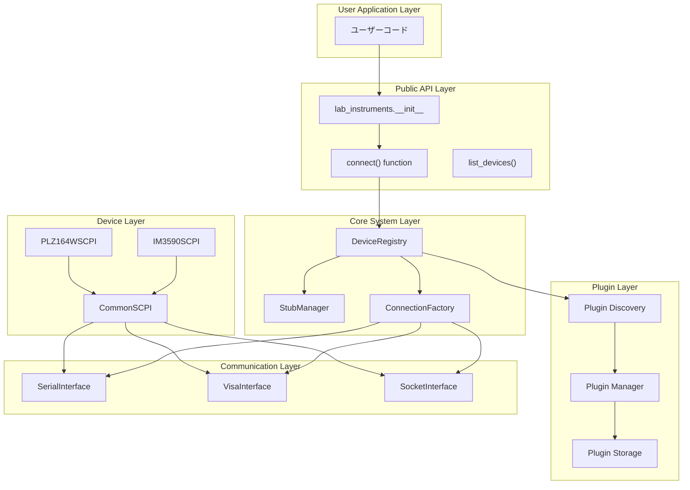
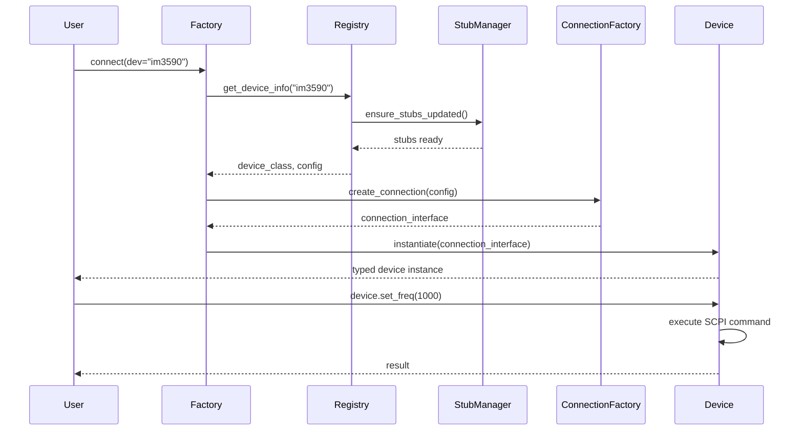

# lab-instruments 開発者向けAPIリファレンス

研究室計測機器制御ライブラリの内部構造・API仕様・拡張開発ガイド

## 📋 概要

本ドキュメントは `lab-instruments` の内部アーキテクチャ、API仕様、プラグイン開発方法を詳解します。

---

## 🏗️ システムアーキテクチャ

### 全体構成図



### データフロー図



---

## 🔧 コアAPI仕様

### 1. ファクトリ関数 (`factory.py`)

#### `connect(dev=None, method=None, plugins_dir="lab_instruments/plugins", **kwargs)`

統一接続関数 - すべての機器接続のエントリポイント

```python
def connect(
    dev: Optional[str] = None,
    method: Optional[str] = None,
    plugins_dir: str = "lab_instruments/plugins",
    **kwargs
) -> Union[CommonSCPI, ConnectionInterface]:
    """
    統一機器接続関数

    Args:
        dev: デバイス名 (例: "im3590", "plz164w")
        method: 接続方式 ("serial", "visa", "socket")
        plugins_dir: プラグインディレクトリパス（後方互換性のため保持）
        **kwargs: 接続パラメータのオーバーライド

    Returns:
        デバイス固有クラス (dev指定時) または 汎用接続インターフェース (method指定時)

    Raises:
        ValueError: 指定されたデバイスまたは接続方式が見つからない場合
        ConnectionError: 機器との接続に失敗した場合

    Note:
        - dev指定時: レジストリからデバイス情報を取得し、型付きSCPIラッパーを返す
        - method指定時: 指定された通信方式で生の接続インターフェースを返す
        - plugins_dirパラメータは後方互換性のため保持されているが、内部的にはレジストリを使用
    """
```

#### 動的型付き接続関数

モジュールは `__getattr__` を通じて、登録されたデバイスごとに型付き接続関数を動的生成します：

```python
# 動的に生成される関数（例）
def connect_im3590(**kwargs) -> IM3590SCPI:
    """IM3590 LCRメーターに接続"""
    return connect(dev="im3590", **kwargs)

def connect_plz164w(**kwargs) -> PLZ164WSCPI:
    """PLZ164W 電子負荷装置に接続"""
    return connect(dev="plz164w", **kwargs)
```

**使用パターン:**

```python
# パターン1: デバイス指定接続 (推奨)
with connect(dev="im3590") as lcr:
    # IM3590SCPIインスタンス、完全な型安全性
    pass

# パターン2: Raw接続
with connect(method="serial", port="/dev/ttyUSB0") as conn:
    # SerialConnectionインスタンス
    pass

# パターン3: 設定オーバーライド
with connect(dev="im3590", port="/dev/ttyUSB1", baudrate=115200) as lcr:
    # カスタム接続パラメータ
    pass
```

#### `list_devices()`

登録済みデバイス一覧を取得

```python
def list_devices() -> List[str]:
    """
    利用可能なデバイス名のリストを返す

    Returns:
        List[str]: 登録済みデバイス名のリスト
    """
```

### 2. デバイスレジストリ (`registry.py`)

#### `DeviceRegistry` クラス

プラグインの自動検出・登録・管理を行うコアシステム

```python
class DeviceRegistry:
    """デバイスプラグイン管理システム"""

    def __init__(self):
        self._devices: Dict[str, DeviceInfo] = {}
        self._plugins_dir: Optional[str] = None
        self._discovery_stats: Dict[str, Any] = {}

    def register(
        self,
        name: str,
        device_class: Type[CommonSCPI],
        config_path: str,
        module_path: str = None,
        plugin_path: str = None
    ) -> None:
        """デバイスを手動登録"""

    def auto_discover(self, plugins_dir: str) -> None:
        """プラグインディレクトリを自動スキャンして登録"""

    def get_device_info(self, name: str) -> DeviceInfo:
        """デバイス情報を取得"""

    def list_devices(self) -> List[str]:
        """登録済みデバイス名のリスト"""

    def get_typed_connect(self, name: str) -> Callable:
        """型付き接続関数を動的生成"""
```

#### `DeviceInfo` データクラス

```python
@dataclass
class DeviceInfo:
    """デバイス情報を格納するデータクラス"""
    name: str
    device_class: Type[CommonSCPI]
    config_path: str
    config: Dict[str, Any]
    module_path: str
    plugin_path: Optional[str] = None
    discovered_at: Optional[datetime] = None
```

### 3. スタブ管理 (`stub_manager.py`)

#### `StubManager` クラス

型安全性とIDE統合のための自動スタブ生成システム

```python
class StubManager:
    """自動型スタブ生成・管理システム"""

    def __init__(self, registry: DeviceRegistry):
        self.registry = registry
        self.stub_file = Path(__file__).parent / "__init__.pyi"

    def generate_stub(self) -> None:
        """型スタブファイルを生成"""

    def update_stub_if_needed(self) -> None:
        """必要に応じてスタブを更新"""

    def _get_device_signature(self, device_info: DeviceInfo) -> str:
        """デバイス固有の型シグネチャを生成"""
```

**生成されるスタブ例:**

```python
# __init__.pyi (自動生成)
from typing import ContextManager
from .plugins.im3590.im3590_scpi import IM3590SCPI
from .plugins.plz164w.plz164w_scpi import PLZ164WSCPI

def connect_im3590(**kwargs) -> ContextManager[IM3590SCPI]: ...
def connect_plz164w(**kwargs) -> ContextManager[PLZ164WSCPI]: ...
```

### 4. 接続ファクトリ (`core/connection_factory.py`)

#### `ConnectionFactory` クラス

低レベル通信インターフェースの生成を担当

```python
class ConnectionFactory:
    """通信インターフェース生成ファクトリ"""

    @staticmethod
    def create_connection(
        method: str,
        **params
    ) -> ConnectionInterface:
        """
        指定された方式で通信インターフェースを作成

        Args:
            method: 通信方式 ("serial", "visa", "socket")
            **params: 接続パラメータ

        Returns:
            ConnectionInterface: 通信インターフェースインスタンス
        """
```

---

## 🔌 通信インターフェース

### 抽象基底クラス (`core/interfaces/connection_interface.py`)

```python
from abc import ABC, abstractmethod
from typing import Optional, Any

class ConnectionInterface(ABC):
    """通信インターフェースの抽象基底クラス"""

    @abstractmethod
    def connect(self) -> None:
        """機器との接続を確立"""
        pass

    @abstractmethod
    def disconnect(self) -> None:
        """機器との接続を切断"""
        pass

    @abstractmethod
    def write(self, command: str) -> None:
        """コマンドを送信"""
        pass

    @abstractmethod
    def read(self) -> str:
        """応答を読み取り"""
        pass

    @abstractmethod
    def query(self, command: str) -> str:
        """コマンド送信+応答読み取り"""
        pass

    def __enter__(self):
        self.connect()
        return self

    def __exit__(self, exc_type, exc_val, exc_tb):
        self.disconnect()
```

### シリアル通信 (`core/interfaces/serial_interface.py`)

```python
class SerialConnection(ConnectionInterface):
    """シリアル通信インターフェース"""

    def __init__(
        self,
        port: str,
        baudrate: int = 9600,
        timeout: float = 1.0,
        **kwargs
    ):
        self.port = port
        self.baudrate = baudrate
        self.timeout = timeout
        self.connection: Optional[serial.Serial] = None

    def connect(self) -> None:
        """シリアルポートに接続"""
        import serial
        self.connection = serial.Serial(
            port=self.port,
            baudrate=self.baudrate,
            timeout=self.timeout
        )

    # その他のメソッド実装...
```

### VISA通信 (`core/interfaces/visa_interface.py`)

```python
class VisaConnection(ConnectionInterface):
    """VISA通信インターフェース"""

    def __init__(
        self,
        address: str,
        timeout: float = 5000,  # VISA timeout in ms
        **kwargs
    ):
        self.address = address
        self.timeout = timeout
        self.resource: Optional[Any] = None

    def connect(self) -> None:
        """VISAリソースに接続"""
        import pyvisa
        rm = pyvisa.ResourceManager()
        self.resource = rm.open_resource(self.address)
        self.resource.timeout = self.timeout

    # その他のメソッド実装...
```

---

## 🎛️ SCPIラッパー基盤

### 共通SCPIクラス (`core/scpi/common_scpi.py`)

```python
class CommonSCPI:
    """SCPI機器の共通基底クラス"""

    def __init__(self, connection: ConnectionInterface):
        self.conn = connection

    def idn(self) -> str:
        """機器識別情報を取得 (*IDN?)"""
        return self.query("*IDN?")

    def reset(self) -> None:
        """機器をリセット (*RST)"""

        self.write("*RST")

    def clear_status(self) -> None:
        """ステータスをクリア (*CLS)"""
        self.write("*CLS")

    def ocp_query(self) -> None:
        """操作完了を待機 (*OPC?)"""
        self.query("*OPC?")

    def check_errors(self) -> List[str]:
        """エラーステータスをチェック"""
        esr = int(self.query("*ESR?"))
        errors = []
        if esr != 0:
            # エラービット解析
            if esr & 0x01: errors.append("Operation Complete")
            if esr & 0x02: errors.append("Request Control")
            if esr & 0x04: errors.append("Query Error")
            if esr & 0x08: errors.append("Device Error")
            if esr & 0x10: errors.append("Execution Error")
            if esr & 0x20: errors.append("Command Error")
            if esr & 0x40: errors.append("User Request")
            if esr & 0x80: errors.append("Power On")
        return errors

    def write(self, command: str) -> None:
        """SCPIコマンドを送信"""
        self.conn.write(command)

    def read(self) -> str:
        """応答を読み取り"""
        response = self.conn.read()
        return response

    def query(self, command: str) -> str:
        return self.query(command)

    def s_send(self, command: str, timeout: float = 5.0, interval: float = 0.1) -> None:
        """
        SCPIコマンドを送信（*OPC, *ESR?による完了・エラーチェック）

        Args:
            command: SCPIコマンド文字列
            timeout: タイムアウト時間（秒）
            interval: ポーリング間隔（秒）

        Raises:
            SCPIError: SCPIエラーが発生した場合
            TimeoutError: タイムアウトした場合
        """

    def s_query(self, command: str, timeout: float = 5.0, interval: float = 0.1) -> str:
        """
        SCPIクエリを実行（エラー監視機能付き）

        Args:
            command: SCPIクエリコマンド文字列
            timeout: タイムアウト時間（秒）
            interval: ポーリング間隔（秒）

        Returns:
            str: クエリ応答

        Raises:
            SCPIError: SCPIエラーが発生した場合
            TimeoutError: タイムアウトした場合
        """

    def __enter__(self):
        return self

    def __exit__(self, exc_type, exc_val, exc_tb):
        if hasattr(self.connection, '__exit__'):
            self.connection.__exit__(exc_type, exc_val, exc_tb)
```

---

## 🔌 プラグイン開発ガイド

### プラグイン構造

```
lab_instruments/plugins/my_device/
├── __init__.py              # 空ファイル
├── config.json             # 接続設定
└── my_device_scpi.py       # デバイス固有SCPIクラス
```

### 設定ファイル (`config.json`)

```json
{
  "method": "serial",
  "serial_params": {
    "port": "/dev/ttyACM0",
    "baudrate": 9600,
    "timeout": 1.0,
    "terminator": "CRLF"
  },
  "socket_params": {
    "host": "192.168.0.10",
    "port": 3590,
    "timeout": 1.0,
    "terminator": "CRLF"
  },
  "metadata": {
    "manufacturer": "Ex-Tech",
    "model": "Ex-1000",
    "description": "LCR Meter",
    "version": "1.0",
    "manual_url": "https://example.com",
    "categories": ["LCR"],
    "supported_interfaces": ["serial", "socket"]
  }
}
```

### デバイス固有SCPIクラス

```python
# my_device_scpi.py
from typing import Dict, Any, Optional
from ...core.scpi.common_scpi import CommonSCPI

class MY_DEVICESCPI(CommonSCPI):
    """MY_DEVICE固有のSCPIコマンドラッパー"""

    def __init__(self, connection):
        super().__init__(connection)

    def set_parameter(self, value: float) -> None:
        """パラメータを設定"""
        command = f"PARAM {value}"
        self.ssend(command)

    def get_parameter(self, idx) -> float:
        """パラメータを取得"""
        response = self.squery(f"PARameter{idx}")
        return float(response)

    def measure(self) -> Dict[str, float]:
        """測定実行"""
        # 測定開始
        self.ssend("MEAS:START")

        # 結果取得
        data = self.squery("MEAS:DATA?")
        values = data.split(',')

        return {
            'value1': float(values[0]),
            'value2': float(values[1]),
            'timestamp': float(values[2])
        }

    def calibrate(self) -> bool:
        """キャリブレーション実行"""
        # 完了待ち（時間がかかる場合）
        try:
            self.ssend("CAL:START", timeout=30, interval=0.5)
        except:
            return False  # タイムアウト
```

### プラグイン自動生成

```bash
python scripts/create_plugin.py my_device
```

---

## 🧪 テスト・デバッグ

下記は人によるチェックがまだ終了していません

### テスト構造

```python
# tests/test_device_integration.py
import pytest
from unittest.mock import Mock, patch
import lab_instruments

class TestDeviceIntegration:
    """デバイス統合テスト"""

    @patch('lab_instruments.core.interfaces.serial_interface.serial.Serial')
    def test_im3590_connection(self, mock_serial):
        """IM3590接続テスト"""
        # モック設定
        mock_connection = Mock()
        mock_serial.return_value = mock_connection
        mock_connection.read.return_value = b"HIOKI,3590,12345,1.0\n"

        # テスト実行
        with lab_instruments.connect(dev="im3590") as lcr:
            result = lcr.idn()
            assert "HIOKI" in result

    def test_device_registry(self):
        """デバイスレジストリテスト"""
        devices = lab_instruments.list_devices()
        assert isinstance(devices, list)
        assert len(devices) > 0
```

### デバッグユーティリティ

#### SCPI対話シェル

```python
# scripts/scpi_shell.py
import lab_instruments
import cmd

class SCPIShell(cmd.Cmd):
    """SCPI対話シェル"""
    intro = "SCPI Interactive Shell - Type 'help' for commands"
    prompt = "SCPI> "

    def __init__(self, device_name: str = None):
        super().__init__()
        self.device = None
        if device_name:
            self.device = lab_instruments.connect(dev=device_name)
            self.device.__enter__()

    def do_connect(self, line):
        """デバイスに接続: connect <device_name>"""
        if self.device:
            self.device.__exit__(None, None, None)

        self.device = lab_instruments.connect(dev=line.strip())
        self.device.__enter__()
        print(f"Connected to {line}")

    def do_write(self, line):
        """SCPIコマンド送信: write <command>"""
        if not self.device:
            print("No device connected")
            return

        self.device.write(line)
        print("Command sent")

    def do_query(self, line):
        """SCPIクエリ実行: query <command>"""
        if not self.device:
            print("No device connected")
            return

        result = self.device.query(line)
        print(f"Response: {result}")

    def do_devices(self, line):
        """利用可能デバイス一覧"""
        devices = lab_instruments.list_devices()
        print("Available devices:", devices)

    def do_exit(self, line):
        """シェル終了"""
        if self.device:
            self.device.__exit__(None, None, None)
        return True

if __name__ == "__main__":
    import sys
    device_name = sys.argv[1] if len(sys.argv) > 1 else None
    SCPIShell(device_name).cmdloop()
```

### ログ設定

```python
# lab_instruments/core/logging_config.py
import loguru
from pathlib import Path

def setup_logging(level: str = "INFO", log_file: str = None):
    """ログ設定をセットアップ"""

    # コンソール出力
    loguru.logger.remove()
    loguru.logger.add(
        sink=sys.stderr,
        level=level,
        format="<green>{time:YYYY-MM-DD HH:mm:ss}</green> | <level>{level: <8}</level> | <cyan>{name}</cyan>:<cyan>{function}</cyan>:<cyan>{line}</cyan> - <level>{message}</level>"
    )

    # ファイル出力（オプション）
    if log_file:
        loguru.logger.add(
            sink=log_file,
            level=level,
            rotation="10 MB",
            retention="7 days",
            format="{time:YYYY-MM-DD HH:mm:ss} | {level: <8} | {name}:{function}:{line} - {message}"
        )
```

---

## 🚀 パフォーマンス・最適化

### プラグイン遅延読み込み

```python
class DeviceRegistry:
    """遅延読み込み対応のデバイスレジストリ"""

    def __init__(self):
        self._devices: Dict[str, DeviceInfo] = {}
        self._lazy_plugins: Dict[str, str] = {}  # name -> module_path

    def get_device_class(self, name: str) -> Type[CommonSCPI]:
        """必要時にプラグインを動的読み込み"""
        if name in self._lazy_plugins:
            module_path = self._lazy_plugins[name]
            module = importlib.import_module(module_path)
            device_class = getattr(module, f"{name.upper()}SCPI")

            # キャッシュに登録
            self._devices[name].device_class = device_class
            del self._lazy_plugins[name]

            return device_class

        return self._devices[name].device_class
```

### 接続プール

```python
class ConnectionPool:
    """接続プール管理"""

    def __init__(self, max_connections: int = 10):
        self.max_connections = max_connections
        self.pool: Dict[str, List[ConnectionInterface]] = {}
        self.active: Dict[str, int] = {}

    def get_connection(self, config_key: str, factory_func) -> ConnectionInterface:
        """プールから接続を取得または新規作成"""
        if config_key not in self.pool:
            self.pool[config_key] = []
            self.active[config_key] = 0

        if self.pool[config_key]:
            conn = self.pool[config_key].pop()
            self.active[config_key] += 1
            return conn

        if self.active[config_key] < self.max_connections:
            conn = factory_func()
            self.active[config_key] += 1
            return conn

        raise RuntimeError(f"Connection pool exhausted for {config_key}")

    def return_connection(self, config_key: str, conn: ConnectionInterface):
        """接続をプールに返却"""
        self.pool[config_key].append(conn)
        self.active[config_key] -= 1
```

---

## 📈 拡張・カスタマイズ

### カスタムプラグインローダー

```python
class CustomPluginLoader:
    """カスタムプラグインローダー"""

    def load_from_git(self, repo_url: str, device_name: str):
        """Gitリポジトリからプラグインをロード"""
        import git
        import tempfile

        with tempfile.TemporaryDirectory() as temp_dir:
            repo = git.Repo.clone_from(repo_url, temp_dir)
            plugin_path = Path(temp_dir) / "plugin"

            # プラグインをコピー
            target_path = Path(f"lab_instruments/plugins/{device_name}")
            shutil.copytree(plugin_path, target_path)

            # レジストリに登録
            lab_instruments.registry.auto_discover()
```

---

## 🔧 トラブルシューティング

### 一般的な問題と解決策

#### 1. インポートエラー

```python
# 相対インポートの問題
# ❌ 間違い
from core.scpi.common_scpi import CommonSCPI

# ✅ 正しい
from ...core.scpi.common_scpi import CommonSCPI
```

#### 2. 型スタブが認識されない

```python
# IDE再起動またはスタブ手動更新
import lab_instruments
lab_instruments.stub_manager.generate_stub()
```

#### 3. デバイスが見つからない

```python
# デバッグ用コード
import lab_instruments

# 登録状況確認
print("Registered devices:", lab_instruments.list_devices())

# プラグイン再スキャン
lab_instruments.registry.auto_discover()

# 詳細情報
for name in lab_instruments.list_devices():
    info = lab_instruments.registry.get_device_info(name)
    print(f"{name}: {info.module_path}")
```

#### 4. 接続エラー

```python
# 詳細ログ有効化
import logging
logging.basicConfig(level=logging.DEBUG)

# 手動接続テスト
try:
    with lab_instruments.connect(method="serial", port="/dev/ttyUSB0") as conn:
        print(conn.query("*IDN?"))
except Exception as e:
    print(f"Connection failed: {e}")
```

---

## 📝 まとめ

`lab-instruments` は以下の設計原則に基づいて構築されています:

1. **統一性**: 単一のエントリポイントですべての機器に対応
2. **型安全性**: 完全な型情報とIDE統合
3. **拡張性**: プラグインベースの柔軟なアーキテクチャ
4. **保守性**: 明確な責任分離と抽象化
5. **開発者体験**: 自動化された型生成とドキュメント

このAPIリファレンスを参考に、効率的な計測機器制御システムを構築してください。

---

_このドキュメントは開発チーム向けの詳細仕様書です。ユーザー向けの情報は [README.md](../README.md) および [使用例](../examples/README.md) を参照してください。_
